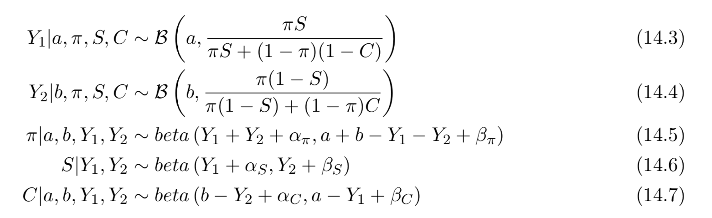

# Problem 14.1.2
Assuming priors of the form: $\pi ∼ beta(α_ψ,β_π), S ∼ beta(α_S,β_S)$ and $C ∼ beta(α_C,β_C)$, it is possible to code up a Gibbs sampler for this problem [8] of the form 

\centering


Priors
```{r}
# Priors
alpha_pi = 1
beta_pi = 1
alpha_S = 1
beta_S = 1
alpha_C = 1
beta_C = 1

```


```{r}
fGibbsSampling <- function(numSamples,a, b){
  
  N <- a + b
  Y1[1] <- as.integer(runif(1, 1, a))
  
  Y2[1] <- as.integer(runif(1, a, b+a))
  
  lpi[1] <- runif(1, 0, 1)
  
  S[1] <- runif(1, 0, 1)
  
  C[1] <- runif(1, 0, 1)
  
  cat("\nBefore Loop: ")
  cat("\nY1:",Y1, " Y2: ", Y1, " lp: ", lpi, " S: ", S, " C: ", C)
  for(t in 2:numSamples){
    
    Y1[t] <- rbinom(n = 1, size = a, prob =  lpi[t-1] * S[t-1] / (lpi[t-1] * S[t-1] + (1 - lpi[t-1]) * (1 - C[t-1]) ))
    
    Y2[t] <- rbinom(n=1, size = b, prob = lpi[t-1] * (1 - S[t-1]) / (lpi[t-1] * (1 - S[t-1]) + (1 - lpi[t-1]) * C[t-1]))
    
    lpi[t] <- rbeta(1, Y1[t] + Y2[t] + alpha_pi, a + b - Y1[t] - Y2[t] + beta_pi)
    
    S[t] <- rbeta(1, Y1[t] + alpha_S, Y2[t] + beta_S)
    
    C[t] <- rbeta(1, b - Y2[t] + alpha_C, a - Y1[t] + beta_C)
    # cat("\n\nAfter t=", t)
    # cat("\nY1:",Y1, " Y2: ", Y1, " lp: ", lpi, " S: ", S, " C: ", C)
    
  }
  
  hist(lpi)
  
}
  
  
```


# Problem 14.1.3
Suppose that out of a sample of 100 people, 20 of those tested negative and 80 positive. Assuming uniform priors on π, S and C, use Gibbs sampling to generate posterior samples for π. What do you conclude?

```{r}
set.seed(41)
Y1 <- vector()
Y2 <- vector()
lpi <- vector()
S <- vector()
C <- vector()

s_lpi <- fGibbsSampling(1000, 80, 20)

```
```{r}
dbinom(x=80, size = 1, prob =0.5)
```

```{r}
lpi
```

```{r}
as.integer(5.1)
```

