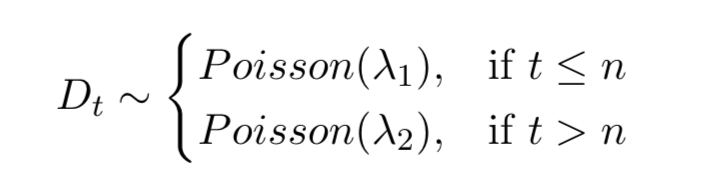

The data in gibbs_coal.csv contains time series of the annual number of coal mining disasters in the UK from 1851-1961 [7]. In this question we are going to use Gibbs sampling to estimate the point in time when legislative and societal changes caused a reduction in coal mining disasters in the UK.
A model for the number of disasters Dt in a particular year t is,

\centering



# 14.2.1 
Graph the data over time. Around what year (n) does it appear the disaster rate occurred?

```{r}
coal_df <- read.csv("data/gibbs_coal.csv")
X <- coal_df$y
```

```{r}
coal_df$y
```

```{r}
plot(coal_df)
linear.model <- lm(coal_df$y ~ coal_df$x)
abline(linear.model)
summary(linear.model)

abline(v=1900, col="blue")
```

# 14.2.6
Write a functionin R that calculates the unnormalised expressionfor p(n|x1:N,λ1,λ2) for a single value of n. Hint: remember that the change point cannot occur at the last data point,
and so return 0 for this case!

```{r}
fPointnConditional <- function(n, X, lambda.1, lambda.2){
  N <- length(X)
  aSum.1 <- sum(X[1:n])
  aSum.2 <- sum(X[(n+1):N])
  if(n == 111){
    return(0)
  }else{
    return(lambda.1 ^ aSum.1 * exp(-n * lambda.1) * lambda.2 ^ aSum.2 *
             exp(-(N - n) * lambda.2))
  } 
}
  
```


#14.2.7. 
Create a function that calculates the discrete probability distribution across all values of n. (Hint: remember this must be a valid probability distribution.)

```{r}
fAllnConditional <- function(X, lambda.1, lambda.2){
  lProb <- sapply(seq_along(X), function(n) fPointnConditional(n, X, lambda.1, lambda.2))
  return(lProb / sum(lProb))
}

```

#14.2.8. 
Create a function that independently samples from the discrete distribution for n you calculate. (Hint use the “sample” function.)

```{r}
fSampleN <- function(lambda.1, lambda.2, X){
  sample(seq_along(X), 1, prob=fAllnConditional(X, lambda.1, lambda.2))
}
```


```{r}
hist(sapply(1:1000, function(i) fSampleN(3, 1, X)), xlab='n')
abline(v=40, col="blue")
```


# 14.2.9 
Write functions to independently sample from the conditional distributions for λ1 and λ2 that you previously determined.

```{r}
fSampleLambda1 <- function(X, a, b, n){
  aSum <- sum(X[1:n])
  return(rgamma(1, (a + aSum), (b + n)))
}
fSampleLambda2 <- function(X, a, b, n){
  N <- length(X)
  aSum <- sum(X[(n + 1):N])
  return(rgamma(1, (a + aSum), (b + N - n)))
}

```

# 14.2.10. 
Combine all three previously created sampling functions to create a working Gibbs sampler. Hence estimate the change-point and its 95% central credible intervals.

```{r}
fGibbsSingle <- function(n, lambda.1, lambda.2, X, a, b){
  n <- fSampleN(lambda.1, lambda.2, X)
  lambda.1 <- fSampleLambda1(X, a, b, n)
  lambda.2 <- fSampleLambda2(X, a, b, n)
  return(list(n=n, lambda.1=lambda.1, lambda.2=lambda.2))
}
```

```{r}
fGibbs <- function(numIterations, n, lambda.1, lambda.2, X, a, b){
  mSamples <- matrix(nrow=numIterations, ncol=3)
  mSamples[1,] <- c(n, lambda.1, lambda.2)
  for(i in 2:numIterations){
    nPrev <- mSamples[(i - 1), 1]
    lambda.1Prev <- mSamples[(i - 1), 2]
    lambda.2Prev <- mSamples[(i - 1), 3]
    lParams <- fGibbsSingle(nPrev, lambda.1Prev, lambda.2Prev, X, a, b)
    mSamples[i,] <- c(lParams$n, lParams$lambda.1, lParams$lambda.2)
  }
  colnames(mSamples) <- c("n", "lambda.1", "lambda.2")
  return(as.data.frame(mSamples))
}
```

```{r}
mTest <- fGibbs(10000, 40, 3, 1, X, 1, 1)
hist(mTest$n)
```
```{r}
library("coda")
HPDinterval(obj = mTest)
```
```{r}
library("bayestestR")
ci(mTest, method = "HDI", ci = 0.95)

```

# 14.2.11. 
Using your sampler determine posterior median estimates for λ1 and λ2.

```{r}
median(mTest$lambda.1)
median(mTest$lambda.2)
```

